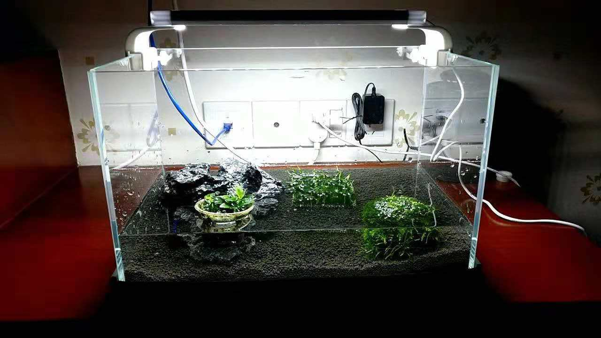
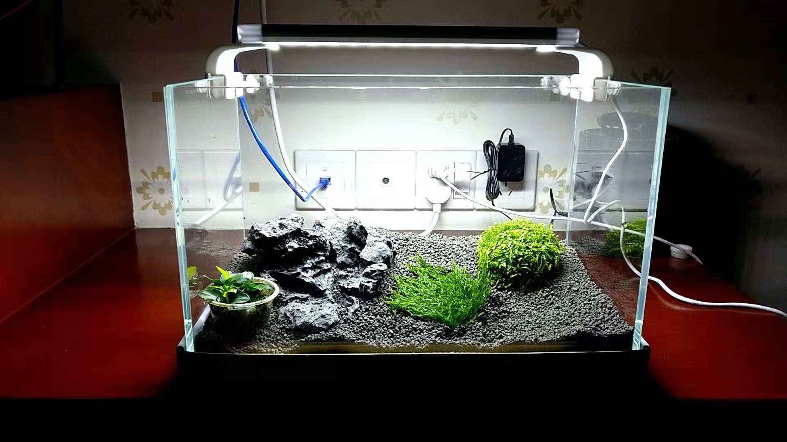
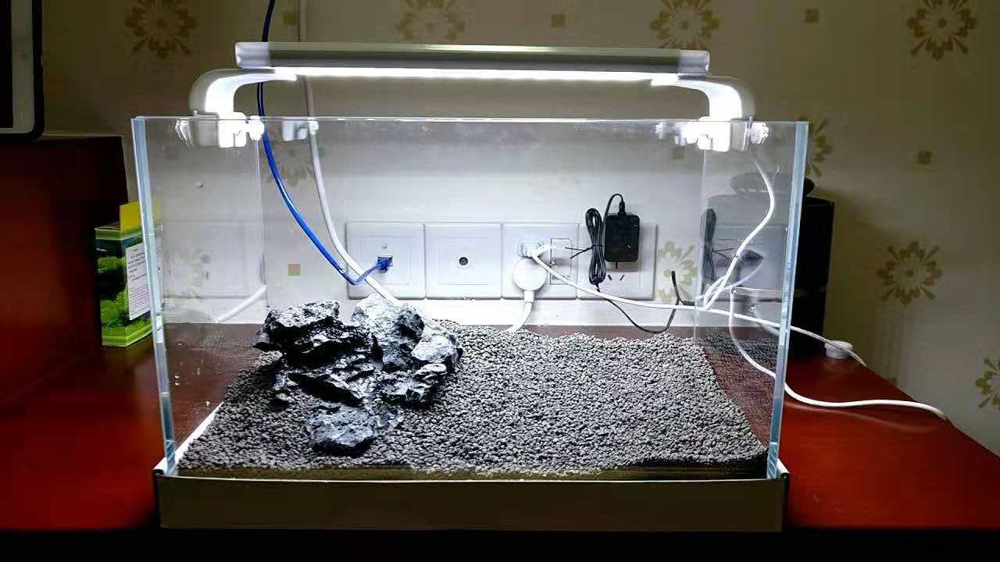
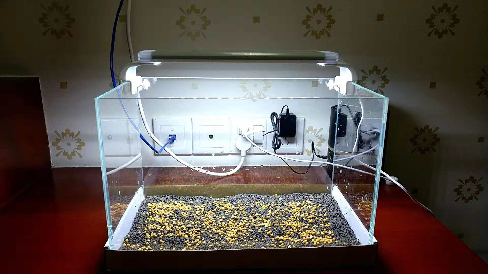

#Current Fish Tank Shot

##Diary
- tank started 10/14/2018
- used koi tank water to seed tank, introduced pods
- hitch-hiker snails arrived with plants
- shrimp and fish introduced 11/13/2018

##Total Cost: ¥679.58

##Live Stock (¥126.8)
- small leaved plant, ¥15  
- moss half sphere, ¥15 
- moss tile, ¥10 
- plant seeds, ¥16.8 
- ~~3~~1 black shrimp, ¥15 
- 3 blue shrimp, ¥15 
- 3 red white shrimp, ¥15 
- ~~5~~4 yellow shrimp, ¥10 
- 3 red shrimp, ¥5 
- ~~1 black white fish~~, ¥5 
- floating plant, ¥5 

##Equipment (¥552.78)
- glass tank (35x20x23cm), ¥35 
- generic led light, ¥25 
- imported substrate, ¥80
- rock, ¥10 
- fertilizer, ¥30 
- thermometer, ¥10 
- hang on back filter (with surface skimmer), ¥98 
- power strip, ¥27.6 
- timer, ¥36.9 
- heater, ¥128 (not in use) 
- turkey baster, ¥8.9 
- curved tweezers, ¥7.88 
- magnetic scrubber, ¥34.5 
- shrimp feed, ¥20 
- net, ¥1 

