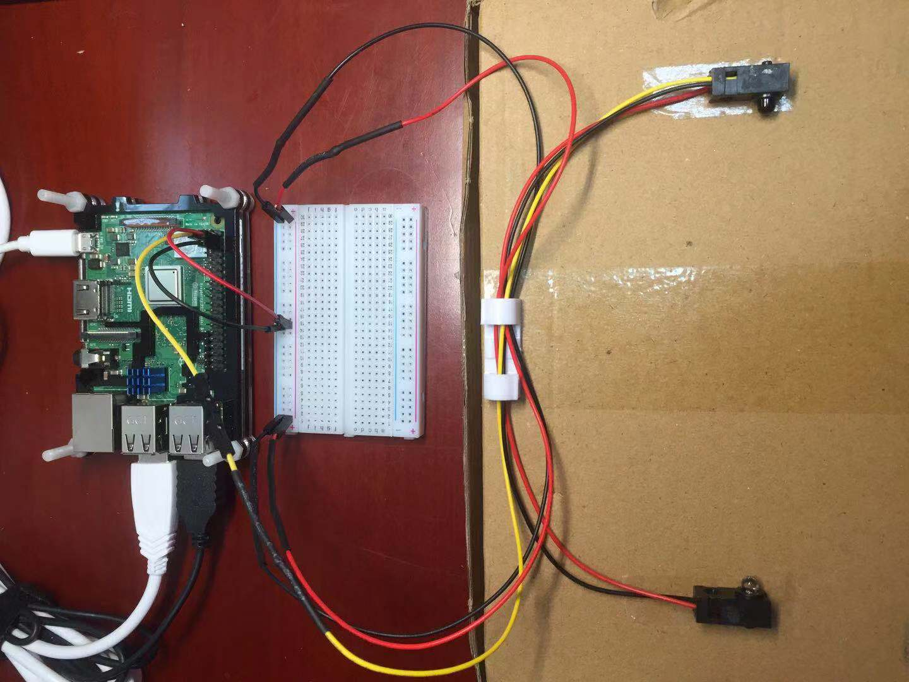
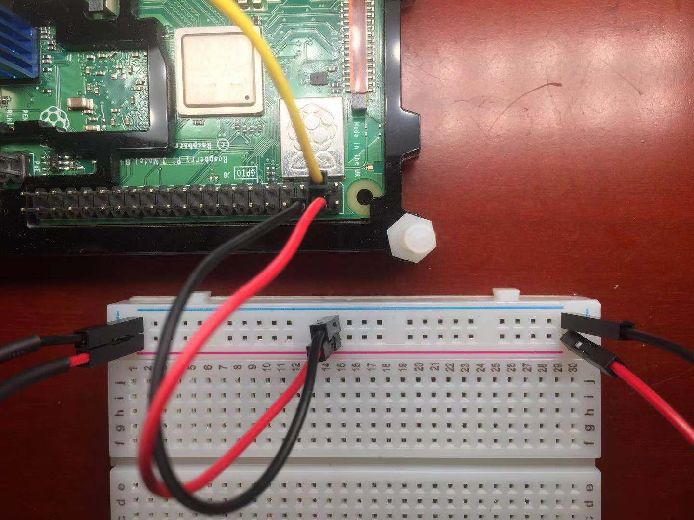

Here is something I wish was online. 

Given that there was a [tutorial](https://learn.adafruit.com/ir-breakbeam-sensors/arduino) covering the the instalation of a [break beam sensor](https://www.adafruit.com/product/2167) for arduino, I was confused when I couldn't find anything for raspberry pi, specifically such that signals could be read in python.

I used a similar sensor to the one linked above.

#Wiring:


###Notes:
- Pin 3 is used as the GPIO input and is connected to the yellow wire from the reciever component.
- Pin 4 supplies 5V to the circuit and is connected to the positive (red) rail on the breadboard.
- Pin 6 is Ground and is connected to the negative (blue) rail on the breadboard.
- The red wires and black wires of the reciever and emitter components are respective connected to the possitive and negative rails.


#Python Code:
```
import RPi.GPIO as GPIO 

GPIO.setmode(GPIO.BOARD) 
GPIO.setup(3, GPIO.IN, pull_up_down=GPIO.PUD_UP) 

sensor_state = 0 
last_state = 0 

try: 
    while True: 
        sensor_state = GPIO.input(3) 
        if sensor_state and not last_state: 
            print('connected') 
        
        if not sensor_state and last_state: 
            print('broken') 
        
        last_state = sensor_state 

finally: 
    GPIO.cleanup()
```

###Notes:

- I enabled the built in internal **pull-up resistor** on the raspberry pi GPIO pins here. 
- The way the GPIO pins work is that they read the amount of voltage supplied to the GPIO pin. In order for the GPIO pin to read a HIGH value, a voltage of greater than 1.6V and less than 3.3V needs to be supplied to the GPIO pin. The signal pin from the break beam sensor does not provide enough voltage, therefore, you enable the pull up resistor on the GPIO pin, such that the signal voltage is 'pulled-up' to 3.3V.
- I used pin 3 as the input pin in this example, you can use any GPIO pin in your implementation.
- The code only prints when there is a change in state.

##If done correctly, console will print alternating "connected" and "broken" depending on the whether there is anything blocking the beam.